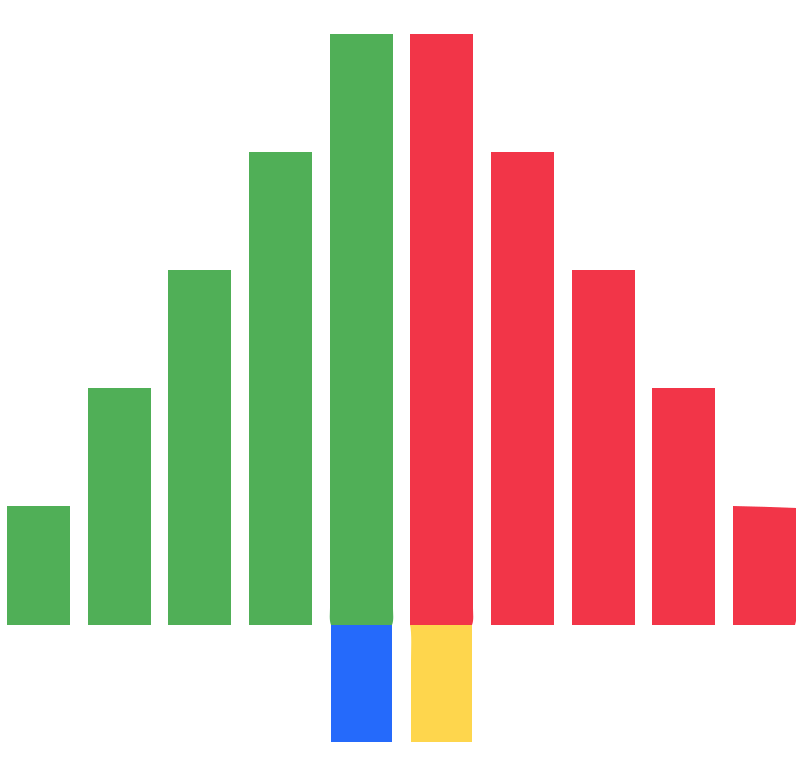
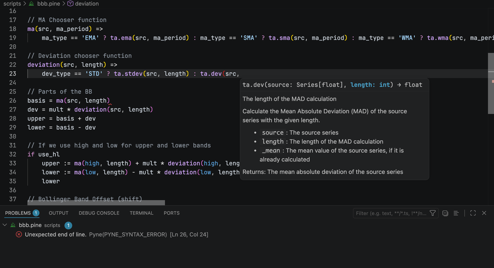
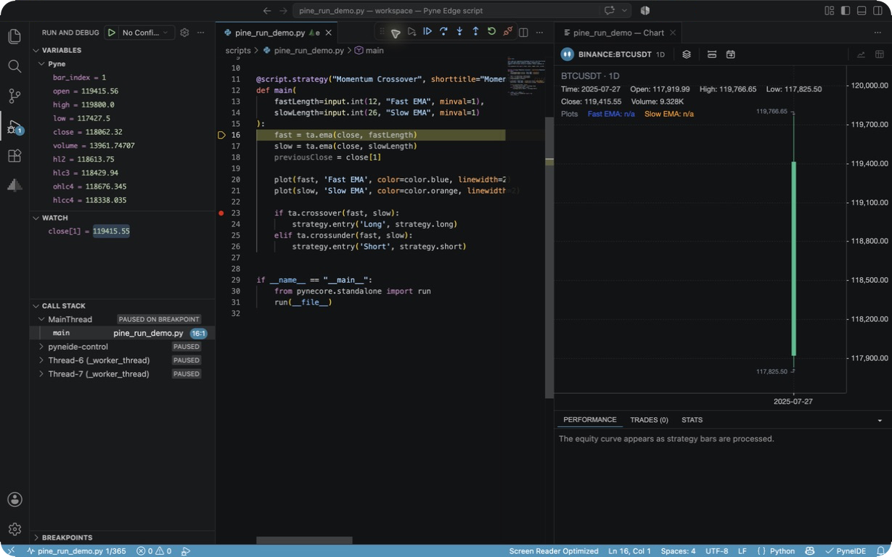
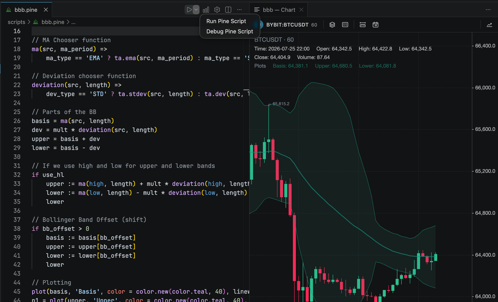
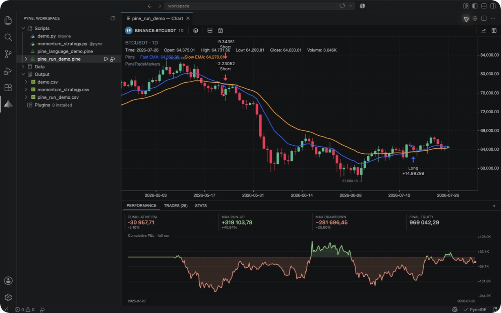
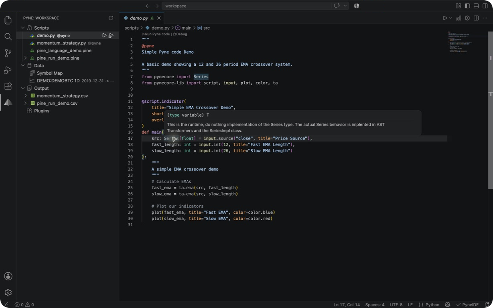
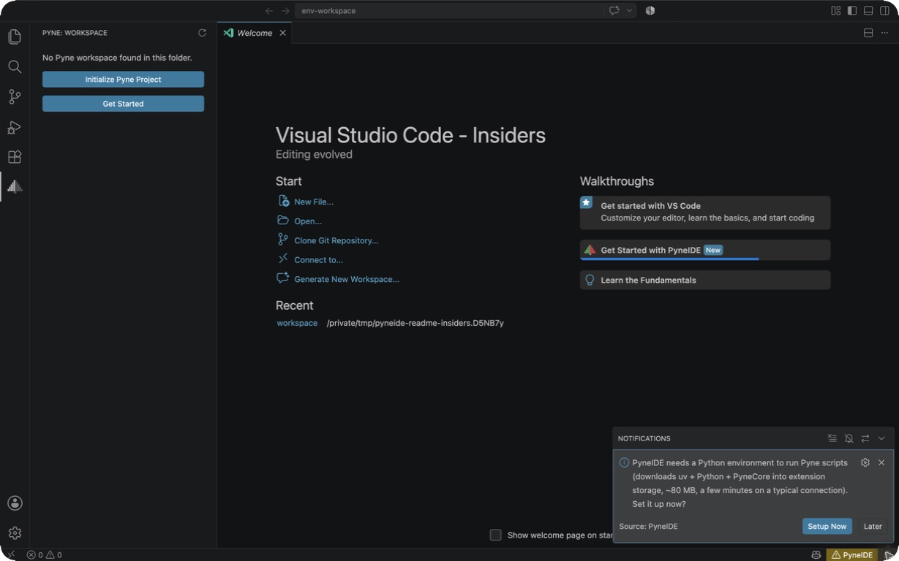
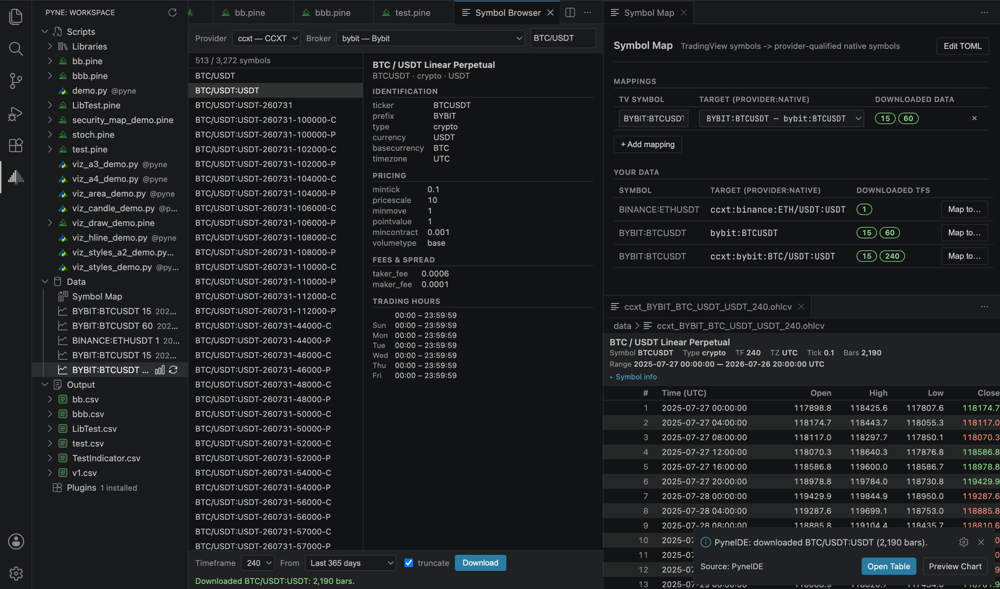

  

<h1 align="center">PyneIDE</h1>

  <strong>The IDE for Pine Script and Pyne, inside Visual Studio Code.</strong> 
  Write it, catch your errors as you type, run it on an interactive chart —
  and debug it bar by bar.

  
  
  
  

---

PyneIDE is a full development environment for **Pine Script** and **Pyne** in Visual
Studio Code. Bring your Pine into a real editor — your own files, your own tooling —
check it as you type, run it on a streaming candlestick chart, and **step through it
in a debugger**, which the TradingView platform doesn't offer. Every script runs
locally on [PyneCore](https://pynecore.org), the open-source (Apache-2.0) Pine
runtime, so your work runs anywhere Python does, with no lock-in — and you can skip
Pine entirely and write the same indicators and strategies as plain Python.

<table>
<tr>
<td width="50%" valign="top">

### Coming from Pine Script?

You don't need to know any Python. Open a `.pine` file and PyneIDE checks it as you
type, compiles and runs it on a real chart, and lets you **debug it** — set
breakpoints, step bar by bar, inspect every value. Everything happens in Pine
terms; the Python underneath stays out of your way.

</td>
<td width="50%" valign="top">

### Prefer Python?

Write the same indicators and strategies as **Pyne code** — ordinary `@pyne` Python
files that run on the open-source PyneCore runtime — with tooling that actually
understands them. No fighting a Python type checker that doesn't get Pine's `Series`
model; PyneIDE ships analysis built for it.

</td>
</tr>
</table>

**In one extension:**

- ✓ Live Pine Script diagnostics, completion, hover and signature help — its own language server.
- ✓ One-click compile and run on an interactive, streaming candlestick chart.
- ✓ A real step-through debugger: go **bar by bar** and set breakpoints on a chart bar — which the TradingView platform doesn't offer.
- ✓ First-class **Pyne code** support with analysis that understands `Series` history, `na`, and persistent state.
- ✓ Runs on the open-source **PyneCore** runtime — no lock-in — with a self-configuring Python environment and **no automatic telemetry**.

## Full Pine Script language support

Open a `.pine` file and you get Pine v6 syntax highlighting, plus completion, hover
documentation and signature help right away — these are built into the extension, so
they work with no setup. A dedicated **Pine Language Server** then checks your code
as you type and reports errors inline — the kind of immediate feedback you'd get in
TradingView's own editor, now in VS Code with your own files and tooling. Your
workspace libraries resolve too — import completion, go-to-definition, hover, and
call-argument checks across both Pine and Pyne.

## A step-through debugger for Pine

This is the feature nothing else gives you: TradingView offers no step-through
debugger for Pine, and PyneIDE adds a real one. Set a breakpoint in your `.pine`
file and **step through it in Pine terms** — not the generated Python — over a
bidirectional Pine ↔ Python sourcemap, with variable names demangled back to what
you wrote. Inspect the current bar's OHLCV and time in a dedicated **Pyne** scope,
and watch series history such as `close[1]` right in the Watch panel.

- **Step bar by bar** — *Next bar* and *Run to bar*, on top of the usual
  line-level stepping.
- **Chart-bar breakpoints** — pause on an exact bar or date by picking it directly
  on the chart.

It works the same whether you wrote Pine or Pyne code.

## One-click compile and run

Press **Run** on a `.pine` file and PyneIDE compiles it to Pyne through the **PyneSys**
cloud compiler, caches the result so unchanged scripts never re-compile, and offers
a free v4/v5 → v6 conversion for older sources. You never see or touch the generated
Python unless you want to. Compiling Pine needs a PyneSys account and API key
([create one at app.pynesys.io](https://app.pynesys.io)); running **Pyne code** needs
no account and runs entirely on your machine.

## Interactive chart and backtests

Every run streams onto a real candlestick chart with faithful Pine plot rendering —
lines, histograms, steplines, areas, `plotcandle`/`plotbar`, `bgcolor`, `barcolor`,
fills, shapes and `hline` — plus script-driven drawings (`line` / `label` / `box` /
`table`). Run a strategy and you also get trade markers on the chart, a full-run
equity/performance curve, and Trades / Stats tables. A per-plot layers popup, a
measure tool, go-to-date, fullscreen, and CSV export of plot and trade data are all
built in.

## Pyne code, done right

**Pyne** is Pine written as ordinary Python — `@pyne` `.py` files that run on
[PyneCore](https://pynecore.org). They *are* real Python, but a stock Python type
checker can't model Pine's `Series` type — a value that is both a scalar and
history-indexable (`close[1]`) — because Python has no intersection type and pyright
has no plugin API. Point plain Pylance at Pyne code and it buries you in false
positives.

PyneIDE solves this properly. It ships its **own bundled analysis** that understands
`Series` history, `na`, and persistent state, adds a **Pyne checker** that flags the
real mistakes PyneCore would reject at import time, and includes a strict **Pyne
Edge** linter for the Pine-compatible Python subset. In a Pyne project it takes over
from Pylance so your diagnostics are *correct* instead of noisy — and defers politely
if you already run pyright or basedpyright. Everything else in your Python workflow
keeps working. Snippets and workspace-library intelligence round it out.

## Zero-setup Python environment

PyneIDE bootstraps its own reproducible Python environment with `uv` — Python plus
the PyneCore runtime — with **no dependency on the Microsoft Python extension** and
nothing to configure. It sets itself up on first run so you can go straight to
writing scripts.

## Data and symbols

Browse and download OHLCV market data from multiple providers with the built-in
**Symbol Browser**, inspect it in a read-only OHLCV table, and map
`request.security()` sources with the Symbol Map. A dedicated **Pyne** activity-bar
view keeps your Scripts, Data, and Output in one place.

## Getting started

1. **Install** PyneIDE from the Marketplace.
2. Open a folder and run **PyneIDE: Initialize Pyne Project** — it scaffolds a
   runnable demo plus sample data.
3. When prompted, let PyneIDE **set up the Python environment** (a one-time download
   of `uv` + Python + PyneCore into extension storage).
4. Press **Run** on the demo and watch the chart appear.
5. To run your own **Pine**: open a `.pine` file, **Sign In** with your PyneSys API
   key when prompted, then Run — it compiles in the cloud and runs like any other
   script. To debug, set a breakpoint and press **Debug**.

## Requirements

- **Visual Studio Code** 1.90 or newer.
- An internet connection for the one-time environment setup, and whenever a Pine
  script compiles — every Run and Debug of a `.pine` file goes through the cloud
  compiler unless the file is unchanged since the last compile.
- For **Pine** compilation: a **PyneSys account and API key**
  ([app.pynesys.io](https://app.pynesys.io)). Writing, running and debugging **Pyne
  code** needs no account — it runs entirely on your machine on the open-source
  PyneCore runtime.

## What is Pyne?

**Pyne** is Pine written as plain Python. It runs on
[PyneCore](https://pynecore.org) — the open-source (Apache-2.0) runtime that mirrors
Pine's bar-by-bar execution model, with zero external dependencies — so Pine-style
indicators and strategies run anywhere Python runs, independently of TradingView.
You can write Pyne code directly, or convert existing **Pine Script** to Pyne with
the PyneSys cloud compiler. PyneIDE is the editor for both paths.

## Privacy and data handling

PyneIDE has **no telemetry of its own**: it never reports on you in the
background, and it collects nothing about how you use the editor. It does talk
to the network in a handful of well-defined places, and it is worth knowing
exactly which ones.

**Pine compilation — PyneSys cloud.** Every Pine path goes through the PyneSys
cloud compiler: the explicit **Compile Pine** and **Convert to v6** commands,
and — this is the one that is easy to miss — **Run and Debug as well**. Running
a `.pine` file compiles it first, automatically and without a separate
confirmation: if you are signed in, your Pine source is uploaded at that moment.
(If you are not signed in, PyneIDE asks you to sign in first, and nothing is
sent until you do; if the file has not changed since the last compile, a local
content-hash cache answers it and there is no upload at all.)

Per the PyneSys [Terms of Use](https://pynesys.io/terms) and
[Privacy Policy](https://pynesys.io/privacy), the service **caches both the
submitted Pine source and the generated Python** — for performance and for
quality assurance. That cached code is tied to your account, is **not shared
with third parties**, and is retained only while your account exists. You keep
all rights to your code. Your account also carries the usual account and usage
records. The linked documents are the authoritative wording — the summary here
only tells you *when* PyneIDE triggers any of it.

**Market data — third-party APIs.** Symbol lookup and OHLCV downloads go
straight from your machine to the data provider you picked — an exchange or
broker, through its own API, with the credentials you configured. These requests
do **not** pass through PyneSys, and what the provider logs is governed by that
provider's own terms. Your API keys stay in the local workdir configuration.

**Report a Problem.** Fully opt-in: nothing leaves your machine until you click
it, it asks separately whether your script may be attached, and it never reads
your API key or broker credentials.

**Downloads.** The one-time environment setup fetches `uv` from GitHub releases,
then Python and PyneCore through it; the optional Pine language server and the
plugin catalogue come from PyneSys (the catalogue is public — no API key, no
account), and plugins install from PyPI.

Everything else — running, charting and debugging Pyne code, and Pine editing
support once the language server is installed — happens **entirely on your
machine**.

## License

PyneIDE is licensed under the **GNU General Public License v3.0 only**
([GPL-3.0-only](https://www.gnu.org/licenses/gpl-3.0.html)). It runs on the PyneCore
runtime, which is open source under Apache-2.0.

---

> **Trademark notice.** Pine Script is a trademark of TradingView, Inc. PyneCore and
> PyneComp are trademarks of PYNESYS LLC. PyneIDE is not affiliated with or endorsed
> by TradingView.
